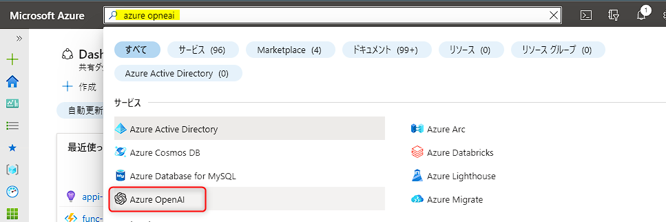
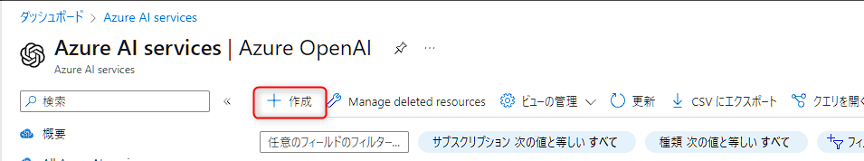
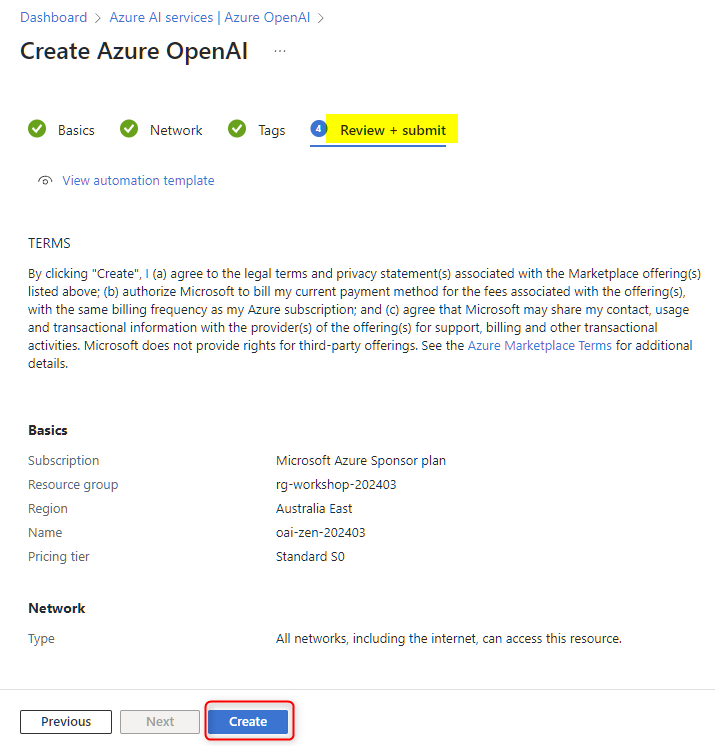
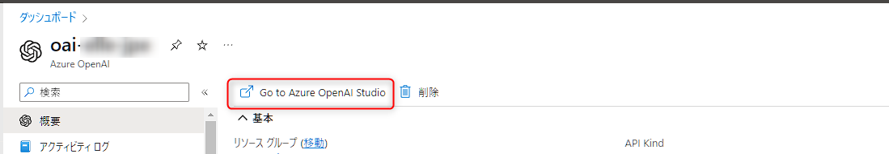
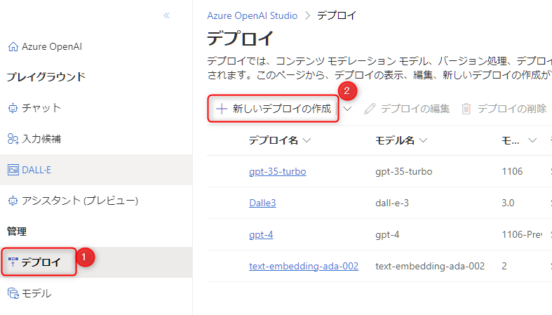
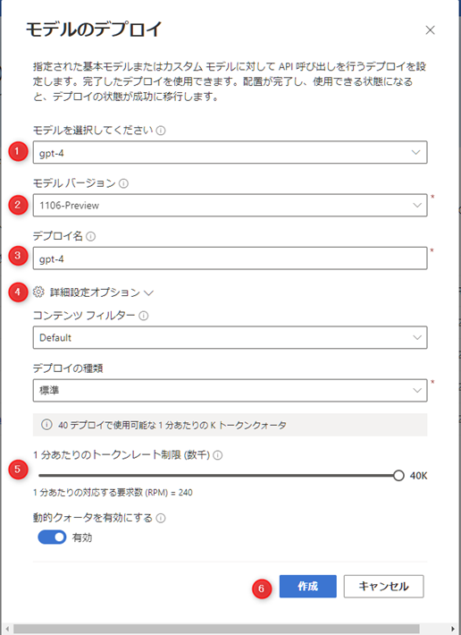

# 🧪 0. Azure OpenAI Service のセットアップ

ここでは、Azure OpenAI Service のリソースの作成とモデルのデプロイを行ないます。

- 0-1. Azure OpenAI Service のリソースの作成
- 0-2. モデルのデプロイ
- 0-3. クォータの更新

## 0-1. Azure OpenAI Service のリソースの作成

> [!IMPORTANT]
> **既に Azure OpenAI Service のリソースを作成済みの場合は、「Azure OpenAI Service のリソースの作成」は飛ばして「0-2. モデルのデプロイ」からご確認ください。**

Azure portal (`portal.azure.com`) を開き、上部の検索で「azure openai」と入力して表示される "Azure OpenAI" をクリックします。

 

Azure OpenAI Service の一覧が表示されますので、"作成" をクリックします。

 

Azure OpenAI の作成画面になります。以下を参考に入力し、"次へ" をクリック (⑥) します。

No.  | 項目 | 入力内容
---: | --- | ---
1 | サブスクリプション | 任意のサブスクリプションを選択します。
2 | リソースグループ | "新規作成" をクリックし、作成可能な任意の文字列を入力します。例: `rg-xxxx-202403` ("xxxxx" は自分のハンドルネームや任意のプロジェクト名などを入力)
3 | リージョン | 任意の場所を選択します。今回利用する　Assistants の機能は利用できるリージョンが限られているため、利用可能なリージョンの一つである「Australia East」(オーストラリア東部) をおすすめします。
4 | 名前 | 任意の名称を入力します。これはグローバルで一意の名称になる必要があります。例:「oai-xxxx-202403」("xxxxx" は自分のハンドルネームや任意のプロジェクト名などを入力してグローバルで一意になるようにします) 。
5 | 価格レベル | "Standard S0" を選択します。

"ネットワーク" と "タグ" はデフォルトの設定のままで "次へ" をクリックし "レビューおよび送信" まで進み、"作成" をクリックします。

 

これでリソースの作成は完了です。リソースの作成が完了したら、"リソースに移動" をクリックします。

## 0-2. モデルのデプロイ

ここでは、ハンズオンで利用する GPT のモデルをデプロイします。以下に記載する対象のモデルですでにデプロイ済みで利用可能なモデルがある場合は、そのモデルを利用しても問題ありません。

- `gpt-4` `gpt-35-turbo` のいずれか

> [!IMPORTANT]
> Assisntants を利用できるリージョン、モデルのバージョンンは以下のドキュメントに記載があります。
>
> - [アシスタント (プレビュー) - Azure OpenAI Service モデル | Microsoft Learn](https://learn.microsoft.com/ja-jp/azure/ai-services/openai/concepts/models#assistants-preview)

### GPT モデルのデプロイ

Azure OpenAI のリソースが表示されたら "概要" の上部にある "Go to Azure OpenAI Studio" をクリックして Azure OpneAI Studio に移動します。

 

以下の手順でモデルのデプロイの準備をします。

- Azure OpenAI Studio の左メニュー "デプロイ" をクリック (①) します。
- "新しいデプロイ" (②)をクリック

 

"Deploy Model (モデルのデプロイ)" の画面が表示されます。

- "モデルを選択してください" で "gpt-4" または "gpt-35-turbo" が選択されていることを確認します (①)。
- モデルバージョン" は、"1106-preview" または "1106" を選択します (②)。
- "Deployment Name (デプロイ名)" には、選択したモデルと同じ名称を入力します (③)。同じ名称が使われているときは任意の名称を入力します。
- "詳細オプション" をクリック (④) して展開し、"1分間あたりのトークンレート制限" をできるだけ大きな値にセットします (⑤)。
- "Create (作成)" をクリックしてデプロイを開始します (⑥)。

## ✨ Congratulations ✨

おめでとうございます🎉。最初の一歩として Azure OpenAI Service のセットアップが完了しました。

---

[📋 目次](../../README.md) | [⏭️ 次へ](./try-assistants.md)
