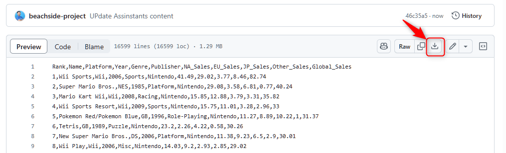
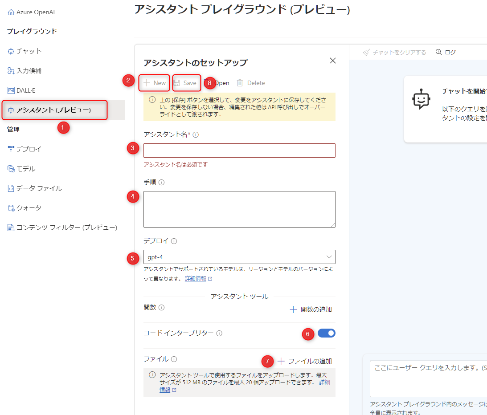
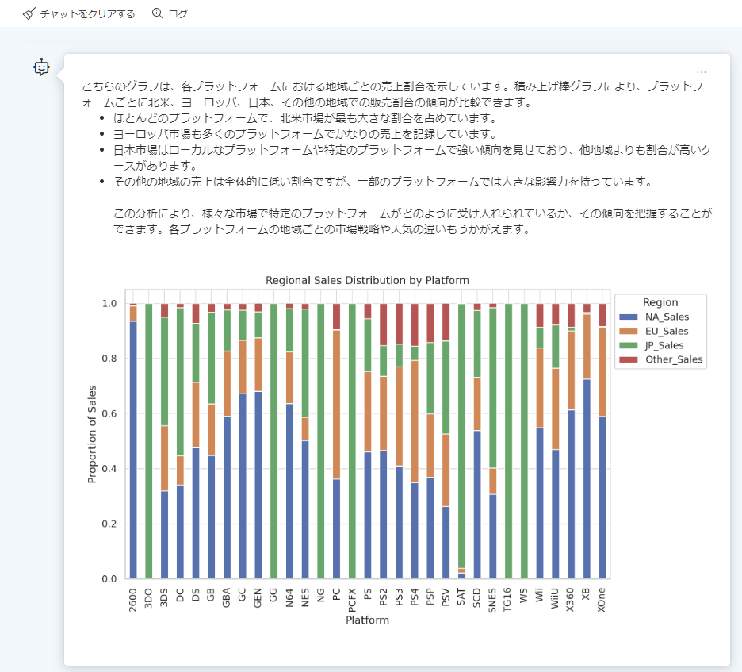

# 🧪 1. Assistants を試す

Azure OpenAI Service で Assisntans の機能を使い、以下の内容を試します。

- Assistants の機能のひとつである Code Interpreter を使ってデータの分析を行います。
- 分析するデータは、kaggle で公開されている [Video Game Sales のデータセット](https://www.kaggle.com/datasets/gregorut/videogamesales) を使います。
  - このデータは、販売本数が 100,000 本を超えるゲームの売上データです。
  - 日本、ヨーロッパ、北米などの地域別、プラットフォーム (プレイステーション2～4や PC、XBOXなど)ごとに売上が記録されています。


Assistants の実行は時間がかかることもあるので、最初にセットアップして質問をしてから、実行中の待ち時間を使って Assisntants の概要を説明します。


TODO:


## 1-1. Assistant のセットアップ

Assistant を、与えた Video Game Sales のデータセットを分析する専門家としてセットアップします。

最初にデータセットをダウンロードします。CTRL キー (または Command キー) を押しながら、[こちらをクリック](data/vdeo-game-sales.csv) ブラウザの別タブで開き、"Download raw file" をクリックしてファイルをダウンロードします。



<br>

Azure OpenAI Service で「アシスタント (プレビュー)」をクリック (①) して以下を参考にセットアップします。

- "New" をクリック (②) します。
- "アシスタント名" (③) には「Video Game Sales Analyst」と入力します。
- 手順 (④) には、以下の内容を入力します。

  ```txt
   あなたは、データ分析の専門家です。
   与えられたデータには販売本数が 100,000 本を超えるビデオ ゲームのリストが含まれています。

   フィールドの定義は以下です。

   Rank - Ranking of overall sales
   Name - The games name
   Platform - Platform of the games release (i.e. PC,PS4, etc.)\
   Year - Year of the game's release
   Genre - Genre of the game
   Publisher - Publisher of the game
   NA_Sales - Sales in North America (in millions)
   EU_Sales - Sales in Europe (in millions)
   JP_Sales - Sales in Japan (in millions)
   Other_Sales - Sales in the rest of the world (in millions)
   Global_Sales - Total worldwide sales.  
  ```

- "デプロイ" (④) には、デプロイしたものを選択します。
- "コードインタープリター" のトグル (⑥)をオンにします。
- "ファイルの追加" をクリック (⑦) し、"ローカルファイルをアップロード" をクリックして、先ほどダウンロードしたファイルをアップロードします。
- 最後に上部の "Save" をクリック (⑧) してセットアップを完了です。



## 1-2. Assistant の動作確認

以下の質問をして、Assistant の動作を確認しましょう。実行に時間がかかるため、回答を待っている間に後述の **1.3. Assistants API の概要** を読み概要や機能の理解を深めましょうましょう。

- 日本で人気の上位10件を教えてください
- Platform ごと地域ごとので売上の傾向を分析してください
- 実行した Python のコードを表示してください。
- Platform が PC で売上の傾向を分析してください。

<br>

## 1.3. Assistants API の概要

- "Assistants" (または "Assisntants API") は、Azure OpenAI Service の機能のひとつで現在プレビュー中です。
- Assistants には、Code interpreter と Function Calling の機能が利用できます。
  - Code interperter は、モデルが質問の回答を生成をする際、Python のコードを実行して回答の生成をサポートします。
  - Function Calling は、自身で定義したプログラムの関数を動的に呼び出すことができます。

Chat Completions API と Assistants API では以下の違いがあります。

Chat Completions API | Assistants API
---|---
ステートレスなので、会話の履歴やコンテキストの保持は自身でプログラムを実装する必要があります。 | 会話の履歴やコンテキストの保持が自動で行われまるため、ステートフルです。
利用する LLM に応じてトークン数の制限を超えないようプログラムで管理する必要があります。 | トークン数の制限を超えないよう自動で管理されます。

質問の待ち時間で、以下のドキュメントで詳細の情報をご参照ください。

- [Azure OpenAI Assistants API (プレビュー) の概念](https://learn.microsoft.com/ja-jp/azure/ai-services/openai/concepts/assistants)
- [Azure OpenAI Assistants (プレビュー) の概要 | Microsoft Learn](https://learn.microsoft.com/ja-jp/azure/ai-services/openai/how-to/assistant)
- [Azure OpenAI アシスタント コード インタープリター (プレビュー) | Micorosft Learn](https://learn.microsoft.com/ja-jp/azure/ai-services/openai/how-to/code-interpreter?tabs=python)
- [Azure OpenAI Assistants 関数呼び出し | Microsoft Learn](https://learn.microsoft.com/ja-jp/azure/ai-services/openai/how-to/assistant-functions?tabs=python)


## ✨ Congratulations ✨

おめでとうございます🎉。これで Assisntans API の体験は完了です。  

プレビュー中の Assistants の機能を使うことで、ステートフルな AI アシスタントを素早く構築することが可能です。  
Python のコードを実行して回答を生成できるため、データからグラフの作成やドキュメントの作成も可能です。

紹介した公式のドキュメントを参考にしながら、Assistants の機能を活用していきましょう。



---

[📋 目次へ戻る](../../README.md)
