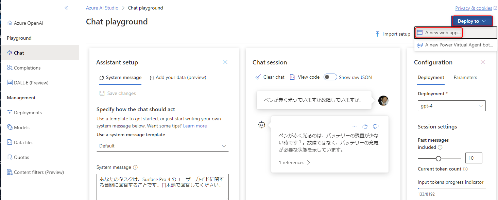
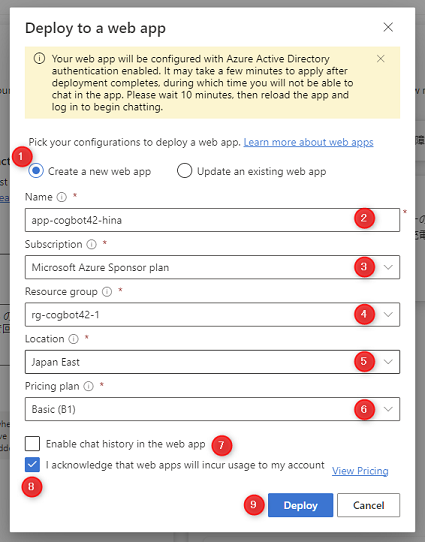
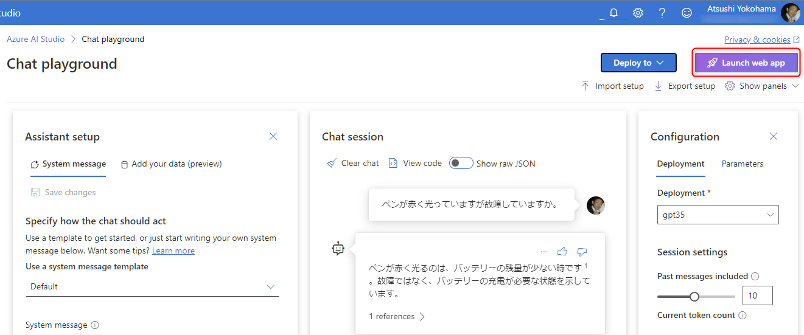
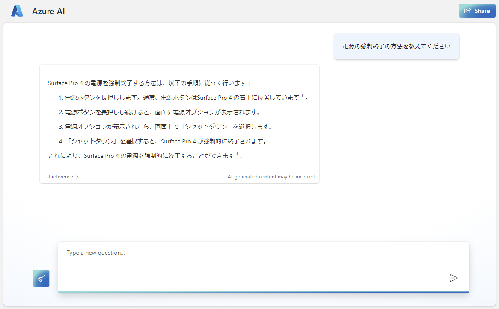

# 🧪 5. On Your Data のデプロイ

Azure OpenAI Studio では、On Your Data で構成した内容を、Azure の Web Apps にデプロイしてチャットの Web アプリとして公開する機能があります。

実践していきましょう。

## 5-1. On Your Data のデプロイ

Chat ployground で On Your Data がセットアップされた状態だと、右上の "Deploy" ボタンが有効になっているのでクリック > "A new web app" をクリックします。

 

以下を参考に入力して、最後に "Deploy" (⑨) をクリックします。クリックするとデプロイが始まります。

No.  | 項目 | 入力内容
---: | --- | ---
1 | Create a new web app | "Create a new web app" を選択します。
2 | name | Web App の名前です。任意の名前を入力します。
3 | Subscription | 今回のハンズオンで利用しているサブスクリプションを選択します。
4 | Resource group | 今回のハンズオンで利用しているリソースグループを選択します。
5 | Location | 今回のハンズオンで利用している地域 (リージョン) を選択します。
6 | Pricing plan | "Basic (B1)" または "Free" を選択します。注意として、ここでは Linux の App Service plan が作成されます。"Free" は作成できる数に制限があるため上限を超えるとエラーになります。**確認方法が不明の場合は "Basic (B1)" を選択してください。**
7 | Enable chat history | チェックをオフにします。チャット履歴を利用したい場合にチェックを入れることで、Cosmos DB のインスタンスが作成されてチャット履歴が保存されます。今回は本質から外れるため利用しません。
8 | I acknowledge that web apps will incur usage to my account | チェックを入れます。

 

デプロイが完了すると、右上に "Launch web app" が表示されますのでクリックします。

 

Web App の URL へ遷移します。初回アクセス時は、アクセス許可の画面が表示されますので "承諾" をクリックします。

 

チャットの UI が表示されます。ここで Azure OpenAI Studio の Chat playground で On Your Data を使ってチャットをしたことと同じ機能が実現できます。

 

## ✨ Congratulations ✨

おめでとうございます🎉。ここでは、Azure OpenAI Studio の On Your Data のデプロイ機能を使い、Web App にチャットのアプリをデプロイする方法を実践しました。

今回デプロイしたリソースについて興味がありましたら、以下のドキュメントで詳細の確認が可能です。

- [モデルのデプロイ (独自のデータに基づく Azure OpenAI) | Microsoft Learn](https://learn.microsoft.com/ja-jp/azure/ai-services/openai/concepts/use-your-data#deploying-the-model)

これでハンズオンプログラムは終了です。今回作成した Azure のリソースで一部にはコストがかかります。そのため、最後のコンテンツとして Azure のリソースを削除の手順を確認しておきましょう。

---

[⏮️ 前へ](./using-postman.md) | [📋 目次](../README.md) | [⏭️ 次へ](./remove-azure-resources.md)
