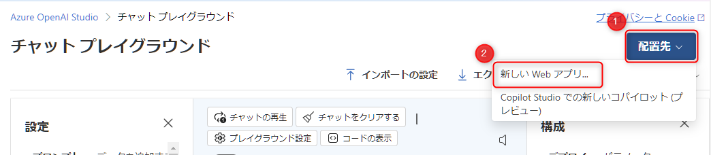
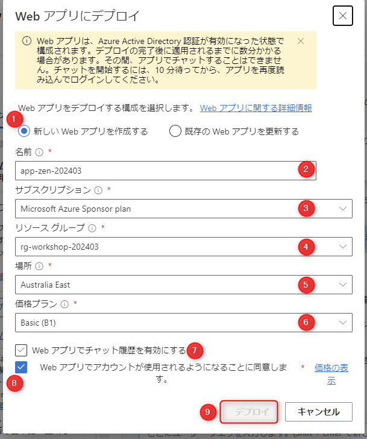
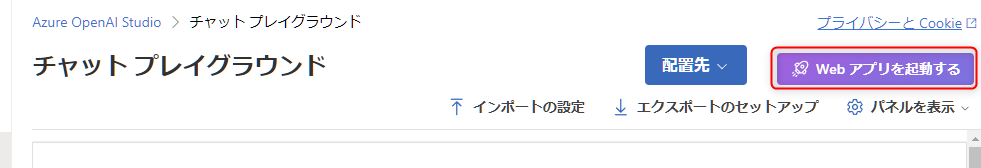
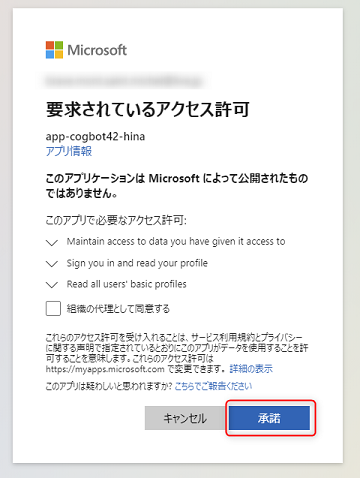
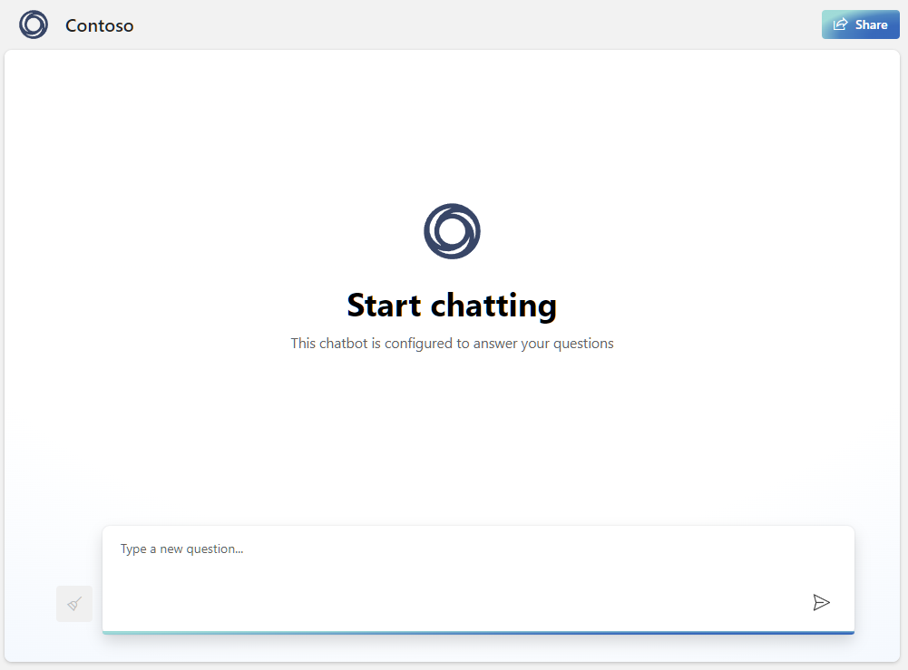

# OPTION: 🧪 On Your Data のデプロイ

Azure OpenAI Studio では、On Your Data で構成した内容を、Azure の Web Apps にデプロイしてチャットの Web アプリとして公開する機能があります。

実践していきましょう。

## 5-1. On Your Data のデプロイ

チャットプレイグラウンドで On Your Data がセットアップされた状態だと、右上の "配置先" ボタンが有効になっているのでクリック > "新しい Web アプリ" をクリックします。

 

以下を参考に入力して、最後に "Deploy" (⑨) をクリックします。クリックするとデプロイが始まります。デプロイの完了まではしばらく10～20分かかることがあります。

No.  | 項目 | 入力内容
---: | --- | ---
1 | 新しい Web アプリを作成する | "新しい Web アプリを作成する" を選択します。
2 | 名前 | Web App の名前です。任意の名前を入力します。例: `app-xxxx-202403` ("xxxxx" は自分のハンドルネームや任意のプロジェクト名などを入力)
3 | サブスクリプション | 今回のハンズオンで利用しているサブスクリプションを選択します。
4 | リソースグループ | 今回のハンズオンで利用しているリソースグループを選択します。
5 | 場所 | 今回のハンズオンで利用している地域 (リージョン) を選択します。
6 | 価格プラン | "Basic (B1)" または "Free" を選択します。注意として、ここでは Linux の App Service plan が作成されます。"Free" は作成できる数に制限があるため上限を超えるとエラーになります。**確認方法が不明の場合は "Basic (B1)" を選択してください。**
7 | web アプリでチャット履歴を有効にする | チェックをオフにします。チャット履歴を利用したい場合にチェックを入れることで、Cosmos DB のインスタンスが作成されてチャット履歴が保存されます。今回は本質から外れるため、また、作成に時間がかかるため利用しません。
8 | Web アプリでアカウントが使用されるようになることに同意します。 | チェックを入れます。

 

デプロイが完了すると、右上に "Web アプリを起動する" が表示されますのでクリックします。

 

Web アプリの URL へ遷移します。初回アクセス時は、アクセス許可の画面が表示されますので "承諾" をクリックします。

 

チャットの UI が表示されます。ここで Azure OpenAI Studio の Chat playground で On Your Data を使ってチャットをしたことと同じ機能が実現できます。

 

## ✨ Congratulations ✨

おめでとうございます🎉。ここでは、Azure OpenAI Studio の On Your Data のデプロイ機能を使い、Web App にチャットのアプリをデプロイする方法を実践しました。

これでハンズオンプログラムは終了です。  
自身のサブスクリプションで実施した場合はコストがかかります。「次へ」をクリックして、作成した Azure のリソースを削除しましょう。

---

[⏮️ 前へ](./setup-on-your-data.md) | [📋 目次](../../README.md) | [⏭️ 次へ](./remove-azure-resources.md)
