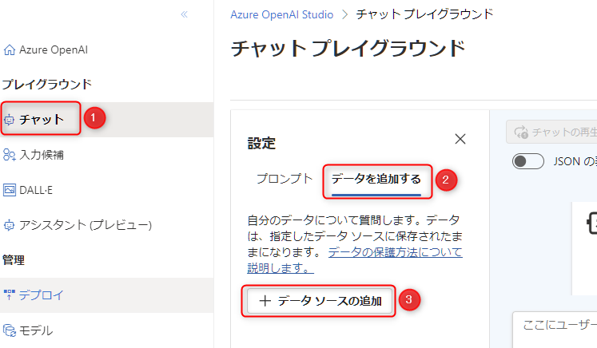

# 🧪 3. On Your Data で独自のデータを活用して回答を生成

ここでは、Azure OpenAI Studio から提供されている "On Your Data" を使って、自分のデータを使った検索を実現します。

以下のサンプルデータを使って、Surface Pro 4 のユーザーガイドの専門家のチャットボットの API を作成します。

- [Surface Pro 4 のユーザーガイド](../sample-data/on-your-data/surface-pro-4-user-guide_ja-jp.pdf)

- 3-1. On Your Data を構成する
- 3-2. Azure OpenAI Studio のチャットから質問して回答を確認する

## 3-1. On Your Data を構成する

Azure OpenAI Studio ( <https://oai.azure.com/> )を開きます。

左メニューの "チャット" (①) > "データを追加する" (②) > "データソースの追加" (③) をクリックします。



<br>

データの追加画面が表示されます。ここで以下を参考に入力を進め、最後に "次へ" ボタンをクリック (⑨) します。

No. | 項目 | 入力内容
---: | --- | ---
1 | データソースを選択する | "Upload files" を選択します。
2 | サブスクリプション | 今回利用する任意のサブスクリプションを選択します。
3 | Azure Blob ストレージ リソースの選択 | 今回作成した Azure Blob storage のリソースを選択します。<br>選択時に **"CORS をオンにする"** のボタンが表示されるのでクリックします。
4 | Azure AI Search リソースを選択する | 今回作成した Azure AI Search のリソースを選択します。
5 | インデックス名を入力してください | 「surface-pro4」と入力します。
6 | ベクトル検索をこの検索リソースに追加します。 | チェックを入れます。
7 | 埋め込みモデルを選択する | 作成した「text-embedding-ada-002」を選択します。
8 | Azure AI Search アカウントに接続すると、アカウントが使用されるようになることに同意します。 | チェックを入れます。


<br>

まず、以下のリンクをクリックします。そして右上のダウンロードのボタンをクリックしてファイルをダウンロードします。

- [Surface Pro 4 のユーザーガイド](../sample-data/on-your-data/surface-pro-4-user-guide_ja-jp.pdf)


<br>

ダウンロードした「Surface Pro 4 のユーザーガイド」をドラッグアンドドロップまたはファイルを開いて選択肢 (①)、"ファイルのアップロード" をクリック (②)してアップロードします。  
アップロードが完了したら "次へ" ボタン (③) をクリックします。


<br>

以下を参考に入力し、"次へ" ボタン (③) をクリックします。

No. | 項目 | 入力内容
---: | --- | ---
1 | 検索の種類 | "ベクトル" を選択
2 | ベクトルの埋め込みを追加すると、アカウントが使用されるようになることに同意します。 | チェックを入れます。


<br>

"レビューして終了" の画面に遷移します。右下の "保存して閉じる" ボタンをクリックします。そうすると、ファイルがストレージアカウントへアップロードされ、AI Search でインデックスが作成されます。

通常1分程度で処理が完了し、チャットの画面で以下のように表示されます。


<br>

これでデータの準備は完了しました。

## 3-2. Azure OpenAI Studio のチャットから質問して回答を確認する

チャットの画面で動作を確認してみましょう。以下の手順に従いチャットの設定を行います。

- 右側にある "デプロイ" (①) で、自身がデプロイしたモデルのデプロイ名を選択します。
- システム メッセージ (②) に次の文章を入力します。

  ```
  Surface Pro 4 の操作や使い方に関する専門家です。
  データソースの情報をもとに Surface Pro 4 に関する質問に回答することがタスクです。
  回答は日本語で生成してください。
  ```

- "変更を適用する" (③) をクリックして、システムメッセージを更新します。


<br>

実際にチャットで質問してみましょう。例として以下のような質問をしてみます。

- 「電源の消し方がわかりません」
- 「ペンが赤く光っていますが故障していますか。」

回答と一緒に参考のリンクが表示されていることで、アップロードしたデータをもとに回答していることがわかります。


<br>

> [!NOTE]
> GPT-4であれば回答できるのに、GPT3.5 だと答えられないこともあり、言語モデルの性能さを感じることもあります。  
> その場合は、システムメッセージをより丁寧に書き換えることで、より適切な回答を得ることができるかもしれませんのでトライしてみましょう。

色々な質問を試してみましょう。  
また、自身の PC の中でアップロードしても差し支えのない PDF やテキストがありましたら、アップロードして質問を試してみましょう。

> [!NOTE]
> もし、Quata limit に関するエラーが起きた場合は、の「[0. Azure OpenAI Service のセットアップ](./setup-azure-openai.md)」の「0-3. クォータの更新」セクションで実施したクォータを更新してお試しください。

## ✨ Congratulations ✨

おめでとうございます🎉。ここでは、Azure OpenAI Studio の On Your Data の機能を使って、自身のデータを検索対象として回答を生成するチャットを実現することができました。

On Your Data についてさらに理解を深めたい場合は、以下のドキュメントをご参照ください。

- [Azure OpenAI On Your Data | Microsoft Learn](https://learn.microsoft.com/ja-jp/azure/ai-services/openai/concepts/use-your-data?tabs=ai-search)

ハンズオンはここまでとなります。

ここで終了する場合、自身のサブスクリプションで実施した場合はコストがかかります。必要に応じて以下の「Azure のリソース削除」に進み、作成した Azure のリソースを削除しましょう。

[⏭️ Azure のリソース削除](./remove-azure-resources.md)

時間が余った場合は、以下の "次へ" をクリックして "On Your Data のデプロイ" に挑戦してみましょう。

[⏭️ On Your Data のデプロイ](./deploy-webapp.md)

---

[⏮️ 前へ](./setup-storage-account.md) | [📋 目次](../../README.md)
