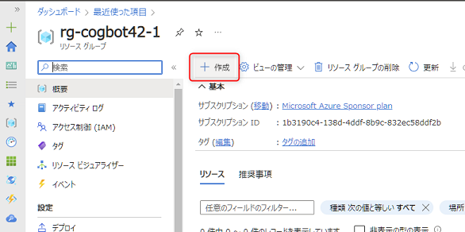
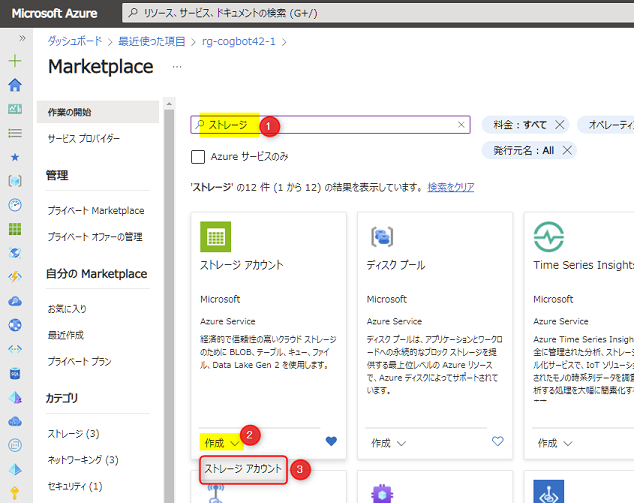
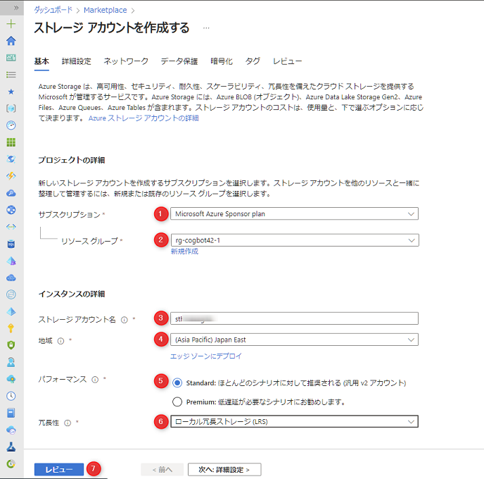

# 🧪 2. Storage account のセットアップ

Azure の Storage account には、Blob/File/Queue/Table のサービスがあります。今回は、On Your Data で利用するファイルを保存するために Storage account のリソースを作成します。

## 2-1. Storage account のリソース作成

引き続き Azure portal で作業を進めます。まず、前節で作成したリソースグループを開き、上部の "作成" ボタンをクリックします。

 

Marketplace の画面が表示されますので、検索で「ストレージ」と入力 (①)して検索し、"ストレージ アカウント" の下部にある "作成" をクリック (②) > "ストレージ アカウント" をクリック (③) します。

 

以下を参考に入力し、最後に "レビュー" をクリック (⑦)します。

No. | 項目 | 入力内容
---: | --- | ---
1 | サブスクリプション | 任意のサブスクリプションを選択します。
2 | リソースグループ | Azure OpenAI Service を作成したときに作ったリソースグループを選択します。
3 | ストレージ アカウント名 | 任意の名前を入力します。
4 | 地域 | AI Search を作成したときに選んだ地域と同じ地域を選択します。
5 | パフォーマンス | "Standard" を選択します。
6 | 冗長性 | "ローカル上長ストレージ(LRS)" を選択します。

 

遷移した画面の下部にある "作成" ボタンをクリックします。これで Storage account の作成が開始され、通常は1分程度で完了します。

## ✨ Congratulations ✨

おめでとうございます🎉。これで Storage account のセットアップは完了です。  

次は Azure OpenAI Studio で On Your Data を構築します。

---

[⏮️ 前へ](./setup-ai-search.md) | [📋 目次](../../README.md) | [⏭️ 次へ](./setup-on-your-data.md)
