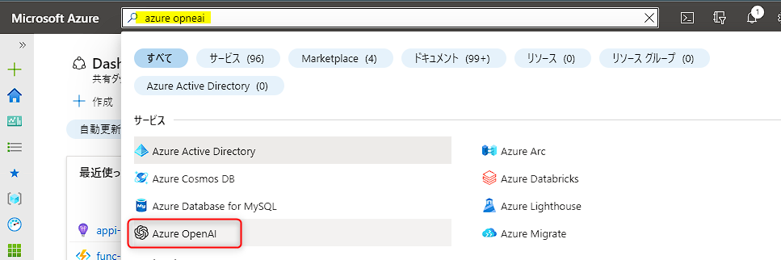
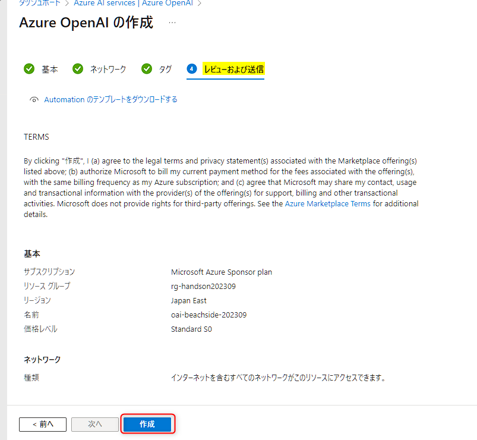
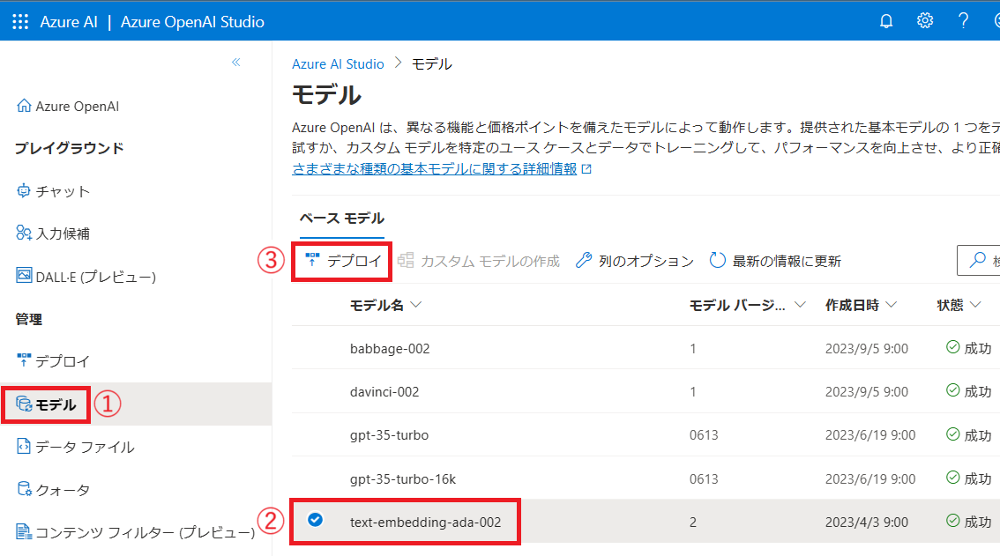
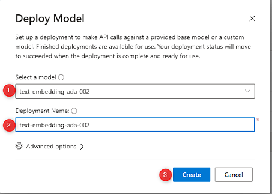
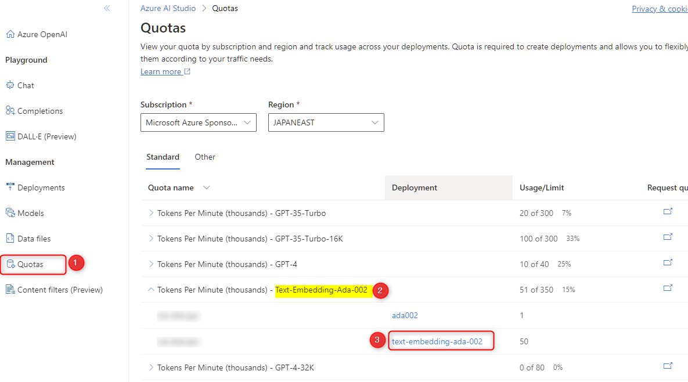
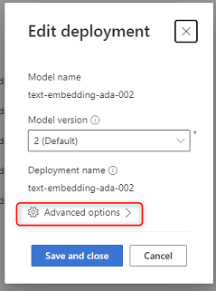
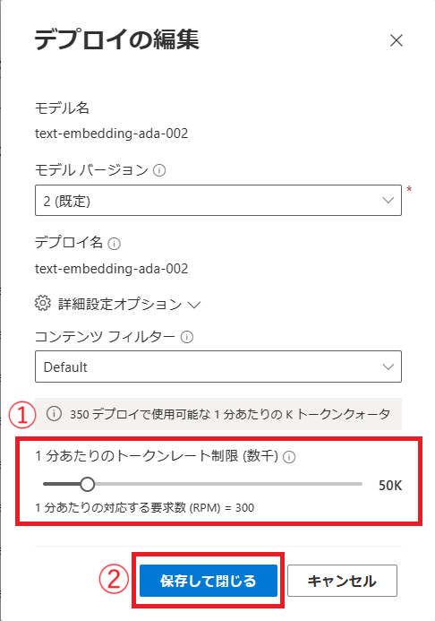

# 🧪 0. Azure OpenAI Service のセットアップ

ここでは、Azure OpenAI Service のリソースの作成とモデルのデプロイを行ないます。

- 0-1. Azure OpenAI Service のリソースの作成
- 0-2. モデルのデプロイ

## 0-1. Azure OpenAI Service のリソースの作成

※ 既に Azure OpenAI Service のリソースを作成済みの場合は、「Azure OpenAI Service のリソースの作成」は飛ばして「0-2. モデルのデプロイ」からご確認ください。

Azure portal (`portal.azure.com`) を開き、上部の検索で「azure openai」と入力して表示される "Azure OpenAI" をクリックします。

 

Azure OpenAI Service の一覧が表示されますので、"作成" をクリックします。

 

Azure OpenAI の作成画面になります。以下を参考に入力し、"次へ" をクリック (⑥) します。

 No. | 項目 | 入力内容
---: | --- | ---
1 | サブスクリプション | 任意のサブスクリプションを選択します。
2 | リソースグループ | "新規作成" をクリックし、「rg-handson202309」と入力します。
3 | リージョン | 任意の場所を選択します。下図は東日本リージョンである「Japan East」を選択しています。
4 | 名前 | 任意の名称を入力します。これはグローバルで一意の名称になる必要があります。例:「oai-xxxx-handson202309」( "xxx" は自分のハンドルネームや任意のプロジェクト名など) 。
5 | 価格レベル | "Standard S0" を選択します。

"ネットワーク" と "タグ" はデフォルトの設定のままで "次へ" をクリックし "レビューおよび送信" まで進み、"作成" をクリックします。

 

これでリソースの作成は完了です。リソースの作成が完了したら、"リソースに移動" をクリックします。

## 0-2. モデルのデプロイ

### text-embedding-ada-002 のデプロイ

Azure OpenAI のリソースが表示されたら "概要" の上部にある "Go to Azure OpenAI Studio" をクリックして Azure OpneAI Studio に移動します。

 

以下の手順でモデルのデプロイの準備をします。

- Azure OpenAI Studio の左メニュー "Models" をクリック (①) します。
- "text-embedding-ada-002" をクリックしてチェックオン (②) にします。
- "Deploy" をクリック (③) します。

 

"Deploy Model" の画面が表示されます。

- "Select a model" で "text-embedding-ada-002" を選択されていることを確認します (①)。
- "Deployment Name" には、Model name と同様の "text-embedding-ada-002" を入力します (②)。
- "Create" をクリックしてデプロイを開始します (③)。

### ChatGPT モデル のデプロイ

前述と同様の手順で、ChatGPT のモデルをデプロイします。モデルは以下のいずれかをお好みでデプロイします。  
また、"Deploy Model" の画面で入力する "Deployment Name" はモデル名と同じにします。こだわりがない場合は `gpt-35-turbo` をデプロイします。

- `gpt-35-turbo-16k`
- `gpt-4`
- `gpt-4-32k`

 

最後に、左メニューの "Deployments" をクリックして2つのモデルがデプロイされていることが確認します。

## 0-3. クォータの更新

Azure OpenAI Service は、TPM (Tokens-per-Minute) という単位で、モデルがアクセスできるトークンの数を制限しています。クォータの詳細について興味がありましたら、以下のドキュメントをご参照ください。

- [Azure OpenAI Service のクォータを管理する | Microsoft Learn](https://learn.microsoft.com/ja-jp/azure/ai-services/openai/how-to/quota?tabs=rest)

ここではハンズオンを円滑に行なうためにクォータを変更します。

画面左の Quatas (①) をクリック > "Text-Embeddings-Ada-002" (②) を展開 > 今回作成した Deployment ID をクリックします。

 

"Advanced options" をクリックします。

 

"Token per Minute Rate Limit" を「50k」に設定 (①)し、"Save and close" (②) をクリックします。

 

同様の手順で、GPTのモデルも10K程度に上げておきます。

## ✨ Congratulations ✨

おめでとうございます🎉。最初の一歩として Azure OpenAI Service のセットアップが完了しました。

次は Cognitive Search のセットアップに進みます。

---

[📋 目次](../README.md) | [⏭️ 次へ](./setup-cognitive-search.md)
