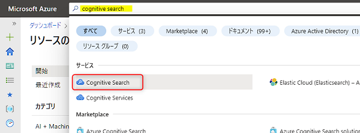
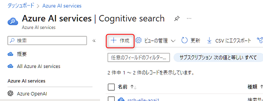
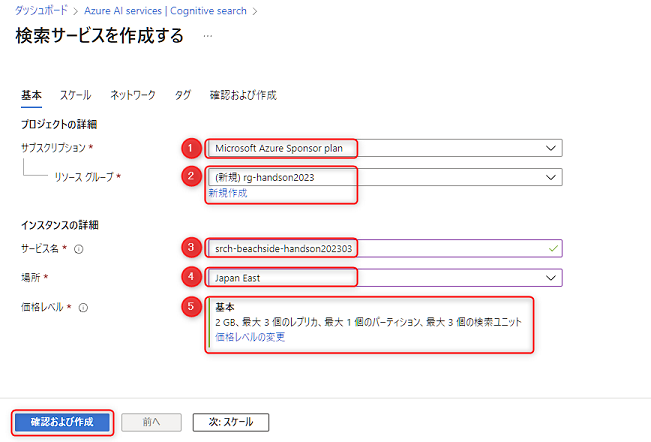
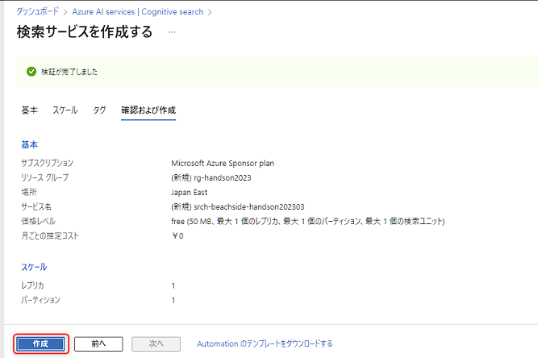
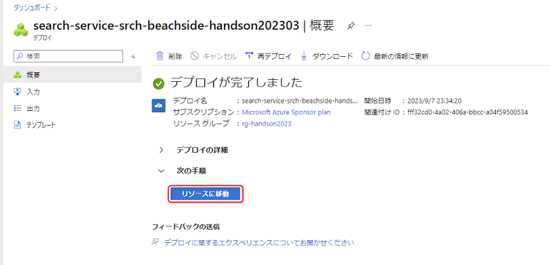

# 🧪 1. Cognitive Search のセットアップ

Cognitive Search は、フルテキスト検索やベクター検索などの検索機能を提供するフルマネージドの PaaS です。ここでは、On your Data で利用する Cognitive Search のリソースを作成します。

## 1-1. Cognitive Search のリソース作成

Azure portal (`portal.azure.com`) を開き、上部の検索で「cognitive search」と入力して表示される "Cognitive Search" をクリックします。

 

Cognitive Search の一覧が表示されますので、"作成" をクリックします。

 

以下を参考に入力し、"確認および作成" をクリックします。

 No. | 項目 | 入力内容
---: | --- | ---
1 | サブスクリプション | 任意のサブスクリプションを選択します。
2 | リソースグループ | Azure OpenAI Service を作成したときに作ったリソースグループを選択します。
3 | サービス名 | 任意の名称を入力します。これはグローバルで一意の名称になる必要があります。例:「srch-xxxx-handson202310」( "xxx" は自分のハンドルネームや任意のプロジェクト名など) 。
4 | 場所 | 任意の場所を選択します。下図は東日本リージョンである「Japan East」を選択しています。
5 | 価格レベル | "基本" (Basic) を選択します。

 

検証が完了したら、"作成" をクリックします。もしエラーが起きた場合は、エラーの内容を確認して修正してください。

 

作成は30秒程度でできます。完了したら、"リソースに移動" をクリックします。

 

## ✨ Congratulations ✨

おめでとうございます🎉。これで Cognitive Search のセットアップは完了です。  
後ほどこの画面から操作をするので、ブラウザのタブは閉じないようにしてください。

次は Storage account のセットアップを行います。

---

[⏮️ 前へ](./setup-azure-openai.md) | [📋 目次](../README.md) | [⏭️ 次へ](./setup-storage-account.md)
