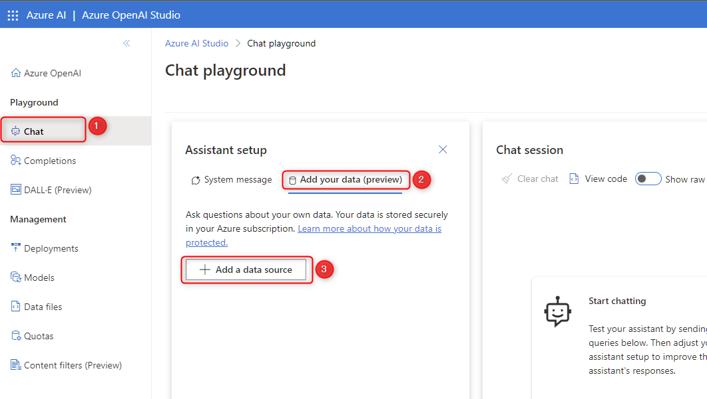
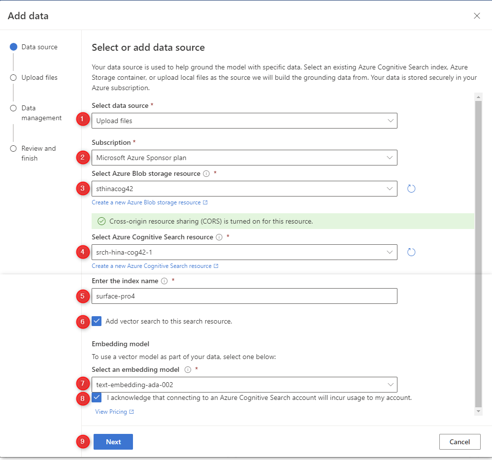
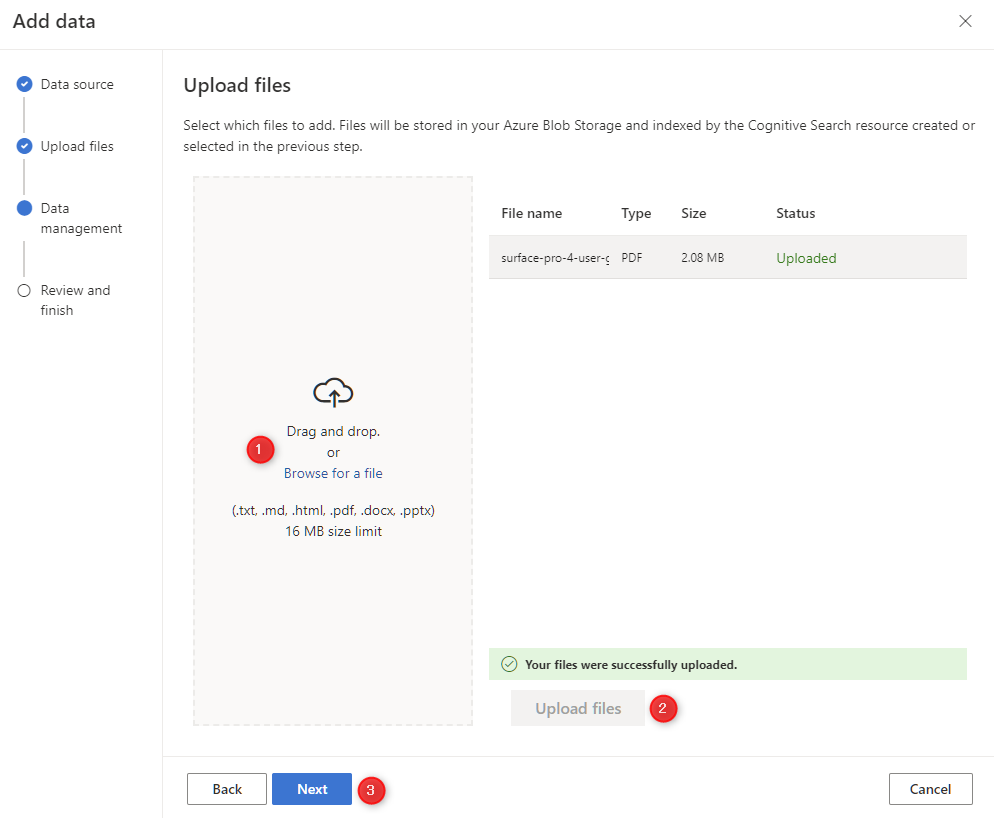
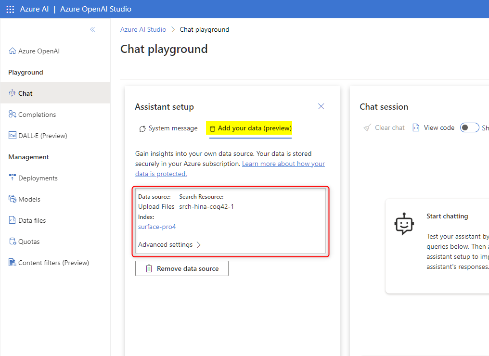
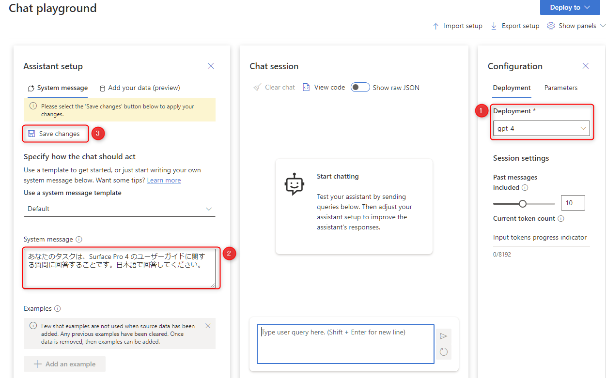

# 🧪 3. On Your Data で独自のデータを活用して回答を生成

ここでは、Azure OpenAI Studio から提供されている "On Your Data" を使って、自分のデータを使った検索を実現します。

以下のサンプルデータを使って、Surface Pro 4 のユーザーガイドの専門家のチャットボットの API を作成します。

- [Surface Pro 4 のユーザーガイド](../sample-data/surface-pro-4-user-guide_ja-jp.pdf)

- 3-1. On Your Data を構成する
- 3-2. Azure OpenAI Studio のチャットから質問して回答を確認する

## 3-1. On Your Data を構成する

Azure OpenAI Studio ( <https://oai.azure.com/> )を開き、左メニューの "Chat" (①) > "Add your data (preview)" (②) > "Add a data source" (③) をクリックします。

 

Select or add data source の画面が表示されます。ここで以下を参考に入力を進め、最後に ”Next" ボタンをクリック (⑨) します。

No. | 項目 | 入力内容
---: | --- | ---
1 | Select data source | "Upload files" を選択します。
2 | Subscription | 今回利用する任意のサブスクリプションを選択します。
3 | Select Azure Blob storage resource | 今回作成した Azure Blob storage のリソースを選択します。 選択時に "Turn on CORS" のボタンが表示されるのでクリックします。
4 | Select Azure Cognitive Search resource | 今回作成した Azure Cognitve Search のリソースを選択します。
5 | Enter the index name | 「surface-pro4」と入力します。
6 | Add Vector search to this search resource | チェックを入れます。
7 | Select an embedding model | 作成した「text-embedding-ada-002」を選択します。
8 | I acknowledge that connecting to an Azure Cognitive Search account will incur usage to my account | チェックを入れます。

 

まず、以下のリンクをクリックします。そして右上のダウンロードのボタンをクリックしてファイルをダウンロードします。

- [Surface Pro 4 のユーザーガイド](../sample-data/surface-pro-4-user-guide_ja-jp.pdf)

 

ダウンロードした「Surface Pro 4 のユーザーガイド」をドラッグアンドドロップまたはファイルを開いて選択肢 (①)、"Upload files" をクリック (②)してアップロードします。アップロードが完了したら "Next" ボタンをクリックします。

 

以下を参考に入力し、"Next" ボタン (③) をクリックします。

No. | 項目 | 入力内容
---: | --- | ---
1 | Search type | "Vector" を選択
2 | I acknowledge that adding vector embeddings will incur usage to my account. | チェックを入れます。

 

Review and finish の画面に遷移します。右下の "Save and close" ボタンをクリックすると、Storage account へファイルがアップロードされ、Cognitve search へインデックスが作成されます。

通常1分程度で処理が完了し、Chat playground 画面で以下のように表示されます。

 

これでデータの準備は完了しました。

## 3-2. Azure OpenAI Studio のチャットから質問して回答を確認する

実際に Chat playground で、以下の手順に従いチャットの設定を行います。

- 右側にある "Deployment" (①) で、自身がデプロイしたモデルの Deployment ID を選択します。
- Sysmtem message (②) に次の文章を入力します。
  - 「あなたのタスクは、Surface Pro 4 のユーザーガイドに関する質問に回答することです。日本語で回答してください。」
- "Save changes" (③) をクリックします。

 

実際にチャットで質問してみましょう。例として以下のような質問をしてみます。

「ペンが赤く光っていますが故障していますか。」

回答と一緒に参考のリンクが表示されていることで、アップロードしたデータをもとに回答していることがわかります。

 

色々な質問を試してみましょう。

もし、Quata limit に関するエラーが起きた場合は、の「[0. Azure OpenAI Service のセットアップ](./setup-azure-openai.md)」の「0-3. クォータの更新」セクションで実施したクォータを更新してお試しください。

## ✨ Congratulations ✨

おめでとうございます🎉。ここでは、Azure OpenAI Studio の On Your Data の機能を使って、自身のデータを検索対象として回答を生成するチャットを実現するすることができました。

次は API を構築、使用するうえでのプラットフォームである Postman を使って、API をコールする方法を実践します。

---

[⏮️ 前へ](./setup-storage-account.md) | [📋 目次](../README.md) | [⏭️ 次へ](./using-postman.md)
